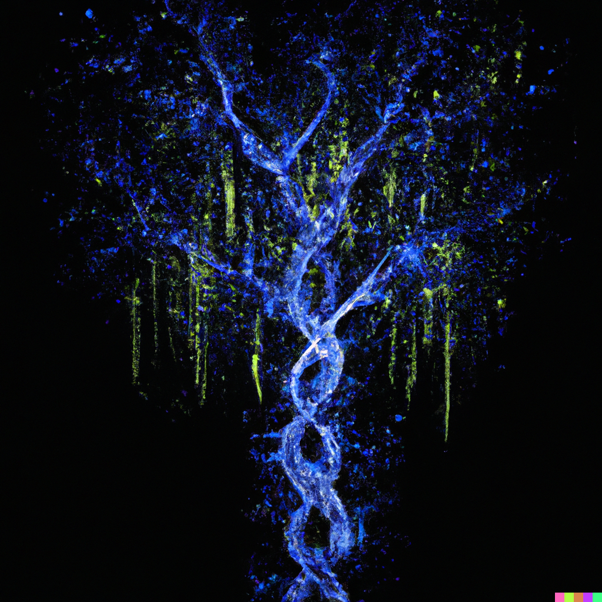

<!-- markdownlint-disable-next-line -->
<p align="center">
  <a href="https://mui.com/" rel="noopener" target="_blank"></a>
</p>

<h1 align="center">PhyloJS</h1>

<div align="center">

[![Build Status][build-img]][build-url]
[![Downloads][downloads-img]][downloads-url]
[![Version][npm-img]][npm-url]
[![Issues][issues-img]][issues-url]
[![Codecov][codecov-img]][codecov-url]
[![semantic-release][semantic-release-img]][semantic-release-url]
[![Commitizen friendly][commitizen-img]][commitizen-url]

</div>

**PhyloJS** is a powerful javascript/typescript library for manipulating phylogenetic trees. It allows users to read and write trees in various formats, extract subtrees, and compute properties such as the most recent common ancestor (MRCA) of a set of nodes, among other features.

PhyloJS is especially helpful in situations where you need to analyze large phylogenetic trees, such as when you're studying evolutionary relationships in bioinformatics or computational biology. PhyloJS is lightweight and has zero dependencies.

## Installation

You can install PhyloJS using npm:

```bash
npm install phylojs
```

Please refer to the [documentation](https://clockor2.github.io/phylojs/) for more API documentation and examples of use for phylojs.

## IcyTree

PhyloJS it derived from Tim Vaughan's [IcyTree](https://icytree.org/) and is similarly licensed under version 3 of the GNU General Public License (GPL).

[build-img]: https://github.com/clockor2/phylojs/actions/workflows/release.yml/badge.svg
[build-url]: https://github.com/clockor2/phylojs/actions/workflows/release.yml
[downloads-img]: https://img.shields.io/npm/dt/phylojs
[downloads-url]: https://www.npmtrends.com/phylojs
[npm-img]: https://img.shields.io/npm/v/phylojs
[npm-url]: https://www.npmjs.com/package/phylojs
[issues-img]: https://img.shields.io/github/issues/clockor2/phylojs
[issues-url]: https://github.com/clockor2/phylojs/issues
[codecov-img]: https://codecov.io/gh/clockor2/phylojs/branch/main/graph/badge.svg
[codecov-url]: https://codecov.io/gh/clockor2/phylojs
[semantic-release-img]: https://img.shields.io/badge/%20%20%F0%9F%93%A6%F0%9F%9A%80-semantic--release-e10079.svg
[semantic-release-url]: https://github.com/semantic-release/semantic-release
[commitizen-img]: https://img.shields.io/badge/commitizen-friendly-brightgreen.svg
[commitizen-url]: http://commitizen.github.io/cz-cli/


## [](https://repography.com) / Recent activity [](https://repography.com)
[](https://github.com/clockor2/phylojs/commits)
[](https://github.com/clockor2/phylojs/issues)
[](https://github.com/clockor2/phylojs/pulls)
[](https://github.com/clockor2/phylojs/commits)
[](https://github.com/clockor2/phylojs/graphs/contributors)
[](https://github.com/clockor2/phylojs/commits)


